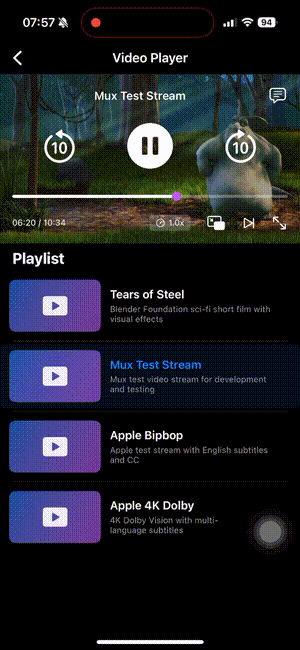
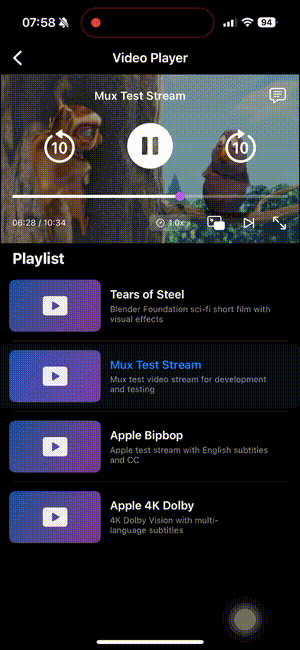
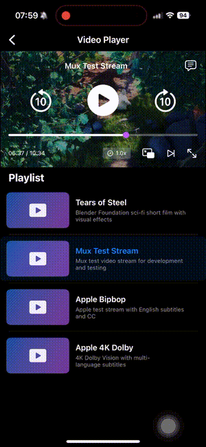
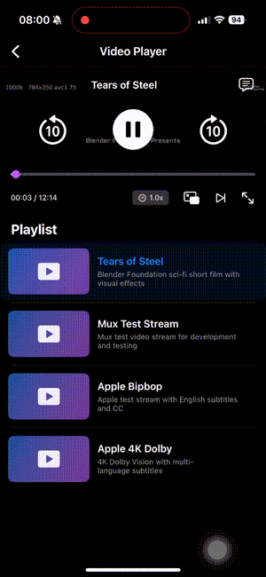
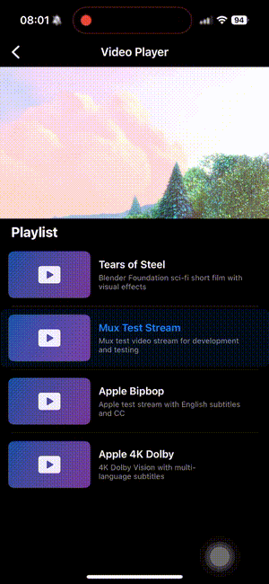
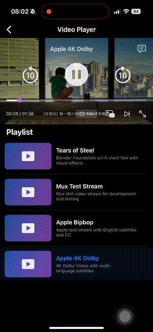
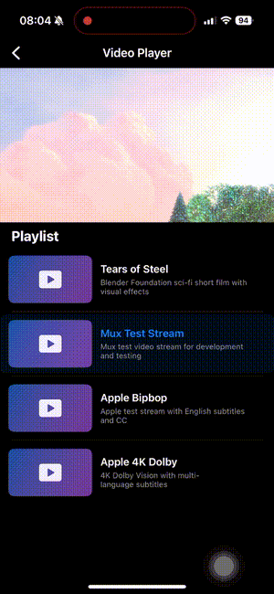
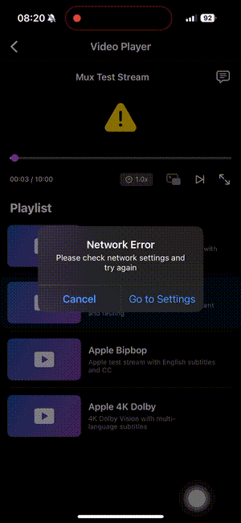

# VideoPlayer

[](https://github.com/Astrid-sudo/VideoPlayer/actions/workflows/test.yml)

An iOS HLS video player built with SwiftUI, featuring custom controls, playlist management, Picture-in-Picture, and lock screen integration.

## Demo

| Seek Bar | Picture-in-Picture | Lock Screen |
|:--------:|:------------------:|:-----------:|
|  |  |  |
| Draggable knob with time preview | Floating video window | Now Playing & Control Center |

| Playlist | Fullscreen | Audio/Subtitle |
|:--------:|:----------:|:--------------:|
|  |  |  |
| Tap to switch videos | Rotation support | Track selection |

| Back Button Navigation | Network Recovery |
|:----------------------:|:----------------:|
|  |  |
| Fullscreen → Back (exit fullscreen) → Back (return to landing & stop playback) | Auto-resume when network reconnects |

## Features

**Playback**
- HLS streaming with custom play/pause, seek bar, and skip controls (±10s)
- Playback speed adjustment (0.5x, 1.0x, 1.5x)
- Draggable seek knob

**Playlist**
- Multi-video playlist with visual indicator
- Auto-advancement with loop support
- Tap to switch videos

**Advanced**
- Picture-in-Picture (PiP)
- Lock screen & Control Center integration
- Audio track and subtitle selection
- Network error detection with auto-recovery

**UX**
- Fullscreen mode with orientation support
- Auto-hiding controls
- Loading and buffering indicators
- Dark and Light mode support
- Localization: English & Traditional Chinese

## Architecture

```
Views (SwiftUI)
    ↓
ViewModel (Input/Output pattern with Combine)
    ↓
Interactors (Business Logic)
    ↓
Services (Protocol-based)
```

| Layer | Responsibility |
|-------|----------------|
| **Views** | UI presentation, user interactions |
| **ViewModel** | Coordinates interactors, exposes reactive state via `@Published` |
| **Interactors** | Business logic (Playback, MediaOptions, RemoteControl) |
| **Services** | Framework wrappers (AVFoundation, MediaPlayer, Network) |

**Key Patterns**
- Protocol-based dependency injection for testability
- Reactive data flow with Combine (`PassthroughSubject` for inputs, `@Published` for outputs)
- Separation of concerns across layers

## Project Structure

```
VideoPlayer/
├── Views/               # SwiftUI views
├── ViewModels/          # NowPlayingViewModel
├── Interactors/         # PlaybackInteractor, MediaOptionsInteractor, RemoteControlInteractor
├── Services/
│   ├── Protocols/       # Abstractions for DI
│   └── Implementations/ # AVPlayer wrapper, AudioSession, RemoteControl, Network
├── Models/              # Video, PlayerState, MediaOption, PlayerError
└── Helpers/             # TimeManager, OrientationManager, Logger
```

## Testing

- **Framework**: Swift Testing (`@Test`)
- **Approach**: Mock/Spy pattern with injected dependencies

| Test Suite | Coverage |
|------------|----------|
| `NowPlayingViewModelTests` | State transitions, playlist, remote control |
| `PlaybackInteractorTests` | Play/pause, seek, speed, queue management |
| `MediaOptionsInteractorTests` | Audio/subtitle selection |
| `TimeManagerTests` | Time formatting, edge cases |
| `PlayerErrorTests` | Error classification |

## CI/CD

GitHub Actions runs on every PR to `main`:
- Builds and runs unit tests on `macos-15` with iPhone 16 simulator
- Automatically uploads `.xcresult` bundle on test failure for debugging

## Known Issues & Notes

**Device Rotation**
- Orientation handling works correctly on physical devices
- Simulator may have inconsistent rotation behavior — test on real device for accuracy

**Debugger Warning**
- When running with debugger attached, you may see:
  ```
  Hang detected: XXs (debugger attached, not reporting)
  ```
- This is expected and caused by the debugger — verified via Console/OSLog
- Does not occur in release builds
